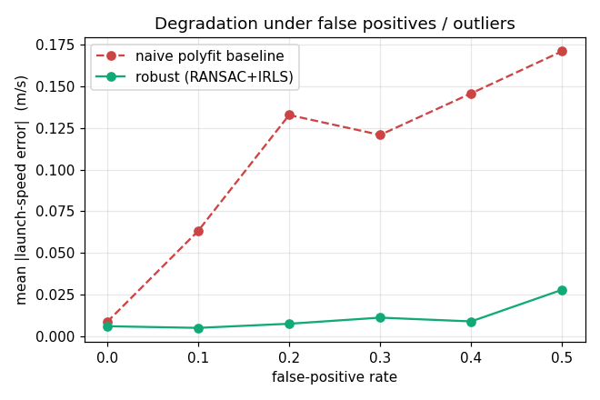
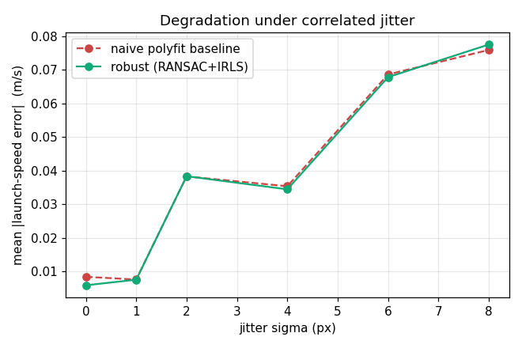
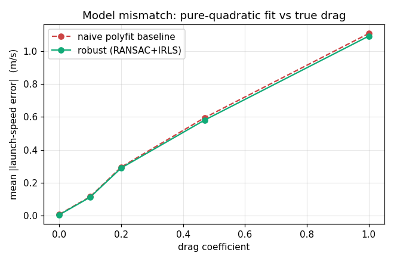
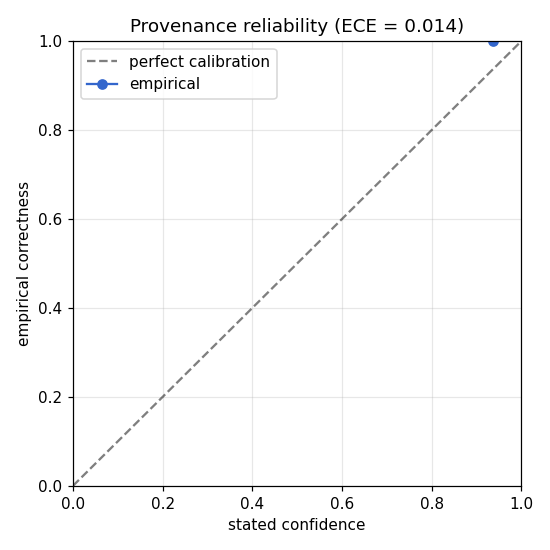

# trackphysics v0.1 — benchmark report (synthetic)

Generated by `python -m bench.run`. Exact metric ground truth from a physics-
simulated, camera-projected ballistic arc; corruption is correlated (not IID).

> **SYNTHETIC-ONLY RUN.** No real footage was evaluated; the sim2real gap is **UNMEASURED**. Set `TRACKPHYSICS_LATTE_MV` to a prepared LATTE-MV directory to add a real-data pass (BRIEF.md §14.3 / §19).

## Clean metric accuracy

Mean launch-speed error on uncorrupted arcs (**realistic drag = 0.2**, a genuine model mismatch for the v0.1 pure-quadratic fit): **0.135 m/s**.

## Graceful degradation (the moat)

Mean |launch-speed error| (m/s) on **drag-free** arcs (drag is a separate axis
below): both methods use identical gravity-as-a-ruler, so the only variable is the
fit — robust RANSAC+IRLS vs naive polyfit. Drag-free isolates the fitting-robustness
effect; mixing drag in would mask it under the common-mode model bias.

**False-positive / outlier rate**
```
level      0.00   0.10   0.20   0.30   0.40   0.50
baseline   0.01   0.06   0.13   0.12   0.15   0.17
robust     0.01   0.00   0.01   0.01   0.01   0.03
```

**Correlated jitter (sigma px)** — robust ≈ baseline here, as expected: RANSAC/IRLS
defends against outliers, not zero-mean Gaussian jitter.
```
level      0.00   1.00   2.00   4.00   6.00   8.00
baseline   0.01   0.01   0.04   0.04   0.07   0.08
robust     0.01   0.01   0.04   0.03   0.07   0.08
```

**Gap bursts (occlusion)** — length of each of two dropped frame-runs (§11 occlusion /
false-negative robustness). The fit must stay accurate as observations are removed.
```
gap_len    0.00   2.00   4.00   8.00  12.00
baseline   0.01   0.00   0.01   0.01   0.01
robust     0.01   0.01   0.01   0.01   0.01
```

**Model mismatch — true drag coefficient** (no corruption; both fits share the
pure-quadratic model bias, so the curve is the honest model-mismatch error):
```
drag       0.00   0.10   0.20   0.47   1.00
robust     0.01   0.11   0.29   0.58   1.09
```

## Provenance calibration

Expected Calibration Error (ECE) of stated confidence vs empirical correctness: **0.014** over **239** scored METRIC emissions (**1/8** confidence bins populated).

> **Known v0.1 limitation (not a validated full-range calibration).** The confidence model is effectively near-binary: any arc clean enough to earn METRIC scores ~1.0, and no METRIC-emitting corruption (drag, gap bursts) pushes it into a low-confidence regime — the detector simply re-finds a clean sub-arc. So the scored emissions concentrate in the top bin: the ECE shows the engine is reliable *where it is confident* (high confidence ⇒ empirically correct), but it does NOT yet exercise a calibrated low-confidence range. A more discriminative confidence model is a v0.2 item; until then read this as a reliability *floor*, not a full-range calibration curve (1 of 8 bins populated).

## Metric-vs-fallback gate

Positive = emits METRIC; ground truth positive = scale genuinely trustworthy. The
negatives include a HARD case — a clean parabola from a STEEPLY pitched camera, where
gravity-as-a-ruler is grossly violated (not trivially separable). Speed bias is measured
at the engine's segment-start instant (the frame it reports), not frame 0.

- precision **0.67**, recall **1.00**, F1 **0.80**, accuracy **0.75**
- confusion: tp=60 fp=30 fn=0 tn=30
- **known limitation:** on steeply-pitched arcs the engine still emits METRIC 100% of the time with a mean speed bias of 49% — it cannot detect the violated assumption monocularly (a v0.2 cross-check item).





