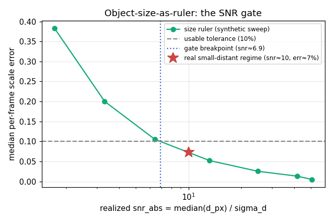

# Object-size-as-ruler — synthetic SNR study

Generated by `python -m bench.size_ruler`. The synthetic generator emits the exact
apparent size `d_px = f*D/Z`, so this maps the size channel's usable envelope under
controlled box-size noise — a generalizable answer to *stereo vs size*, with a real
small-distant regime placed on the curve analytically (BRIEF.md §10, §14).

## 1. Clean ruler accuracy + the size↔gravity cross-check

| geometry | size ruler per-frame err | gravity scale err vs truth | cross-check rel-disc |
|---|---|---|---|
| side_on | 0.0% | 0.7% | 0.7% |
| depth_motion | 0.0% | 38.9% | 28.0% |
| steep_tilt | 0.0% | 58.1% | 36.7% |

The size ruler is near-exact when clean (≤0.0% per-frame across all three) — it inverts the projection. Gravity-as-a-ruler is accurate side-on (0.7% err, 0.7% disc) but biased when its assumptions break, and the cross-check catches both:

- **depth motion** (level camera — the documented §10 limitation, image-y still maps to vertical): 38.9% gravity error, flagged by a 28.0% cross-check disc;
- **camera tilt** (a *different* violation — vertical mis-map): 58.1% error, flagged by 36.7%.

So an independent size cue **flags a biased gravity scale whatever the cause** — depth OR tilt. (Flagging the bias is not recovering the depth.)

## 2. The SNR gate (absolute scale)

Size-ruler median per-frame scale error vs realized `snr_abs = median(d_px)/sigma_d`
(depth-motion arc, correlated box-size noise). The gate is ~invariant to object
size/distance — it depends on snr_abs, since rel scale error ≈ 1/snr_abs by
construction (verified across object sizes; see DECISIONS.md):
```
snr_abs     50.5    41.8    24.8    13.2     6.4     3.3     1.7
err         0.5%    1.3%    2.5%    5.2%   10.5%   20.0%   38.3%
```
Breakpoint (error crosses 10%): **snr_abs ≈ 6.9**.

## 3. Real small-distant regime (analytic placement)

At the real regime's `snr_abs ≈ 10` the curve gives a size-scale error
of **≈ 7%** — a *marginal absolute cross-check*, not a tight ruler.

The separate **depth-recovery** use is judged here **by threshold, not measured**: it
needs `snr_dyn ≥ 3` (`SizeRulerThresholds.min_snr_dyn`, a refittable default — there
is no depth-recovery sweep here; that recovery path is unimplemented v0.2 work).
The real regime's `snr_dyn ≈ 2.5` is below it ⇒ depth recovery from the
size channel is **INFEASIBLE**.

> **Verdict (region-scoped — usefulness is a function of snr_abs, not universal).**
> *Below* the gate (small/distant: e.g. ~40 mm at a few meters, snr_abs≈10) the size
> channel is only a **marginal absolute-scale cross-check** and depth recovery is
> infeasible — but this is the regime where size *must* fail, not a general indictment.
> *Above* the gate (large/close: basketball, thrown box, robot payload — diameter
> tens–hundreds of px, snr_abs ≫ gate) size becomes a **STRONG absolute-scale cue** that
> competes with gravity-as-a-ruler and partially substitutes for stereo *for scale*
> (depth-*velocity* recovery is hard even there). That high-SNR regime is NOT reachable
> on a small/distant dataset and is **unvalidated on real data** — the one real-detector
> run worth doing is confirming these (synthetic-calibrated) thresholds on a large/close
> object, not another small-object pass. Recovering the missing depth still needs stereo.
> Numbers for a specific dataset belong in the internal validation artifact (license).


